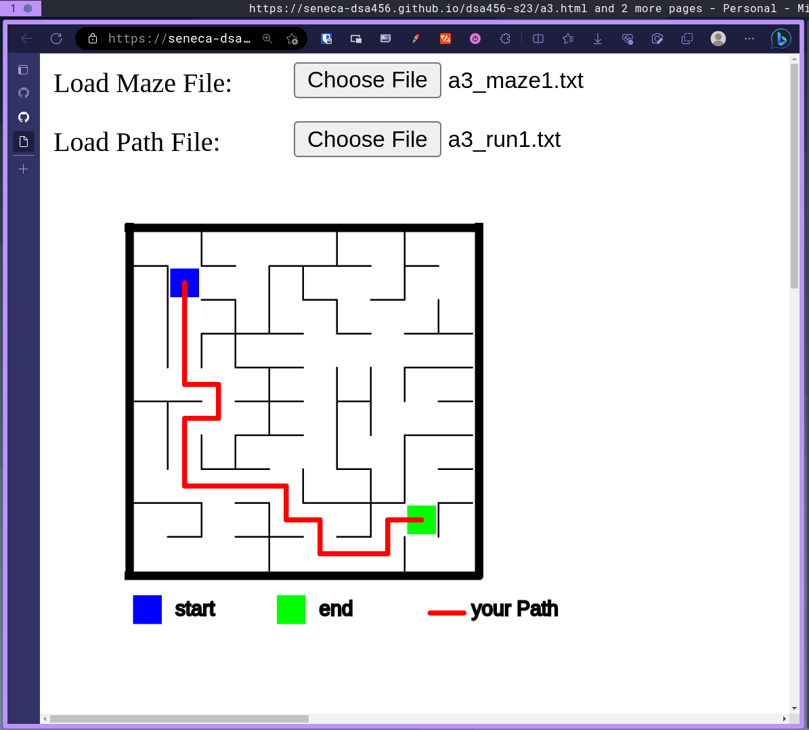
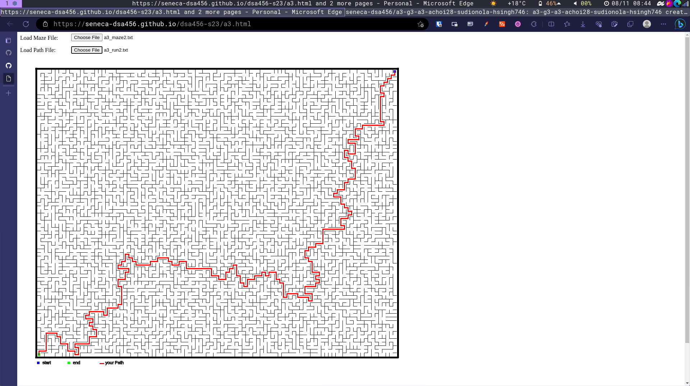

# Part C

## Maze 1:

## Maze 2:

# Part D: Reflections

## Reflection for hsingh746

1. Please detail what exactly **you** did for the assignment. 
  Completing this assignment was quite an interesting experience. I learned a lot about data structures and algorithms through the practical implementation of MinHeap, Prim's algorithm, and maze generation.
2. What was one thing **you** learned when doing this assignment? 
  One thing I learned was the importance of choosing the right data structures and algorithms for the task. For example, using a MinHeap greatly improved the efficiency of selecting edges with the minimum weight in Prim's algorithm, leading to a more optimized solution.
3. What was its most challenging aspect and what did **you** do to overcome this challenge? 
  The most challenging aspect was implementing the maze generation algorithm. Initially, grasping the concept of generating corridors using the minimum spanning tree was a bit challenging. However, I overcame this challenge by breaking down the process step by step and visualizing the intermediate results. Additionally, debugging and ensuring that the maze was generated correctly took some time and effort.

## Reflection for Achoi28

1. Please detail what exactly **you** did for the assignment.
  Part b, created the MST function
2. What was one thing **you** learned when doing this assignment?
  Trying to figure out how to get the proper mininum weight from the array to properly get the output. Had some issues with incorrect values being stored, no values being stored, and duplicates. I had to restudy on how heap works as I kept confusing it with hash, and trying to figure out bubble down/bubble up works.
3. What was its most challenging aspect and what did **you** do to overcome this challenge?
  Trying to figure out all the function calls and proper recursive calls not to save incorrect or duplicate values in the mst. Rememering how heap works

## Reflection for Stephen Dionola

1. Please detail what exactly **you** did for the assignment.
  - I finished the entirety of part c, including the recursive maze solver which I made in assignment 1.
2. What was one thing **you** learned when doing this assignment?
  - I learned how to implement a maze generator with a simple input of a number of rows and columns in it. I always wondered always wondered how the maze that I recursively solved in assignment 1 was created, and the assignment enabled me to finally come full circle by understanding that this was all thanks to creating a randomized weighted graph with the maze's path getting cleared up through the help of a minimum spanning tree. I would have never thought that the holes in a maze could be generated by simply utilizing a minimum spanning tree, but thanks to the assignment, I could add the arsenal which is a graph and an mst to deal with mazes moving forward.  
3. What was its most challenging aspect and what did **you** do to overcome this challenge?
  - Despite what I would personally consider to be the easiest assignment part that I have been tasked to work on thus far, the only part that was met with some struggle would have to be the creation of the maze list right at the very start. This was probably due to this being the only part of part c that did not outright spell out what each line would have to be, but looking through the example of the 3 x 4 maze grid made it easier to see how they probably implemented it. 
  
  -I noticed that there were two sets of patterns in the list, namely, (0, 1)... where there is an increment of 1, with it skipping every so often, and the right side which is (0,4)... where there is an increment of 4. Piecing them together it was then a trivial task to find which indexes to include and which ones not to, by both intuition and trial and error. I decided to only append code from the left side if after incrementing by 1 it is a multiple of the number of columns, thus representing the end of each row, and the right side skipping the last row, which is simply the total walls minus the number of columns, representing the amount of indexes in the last row.

